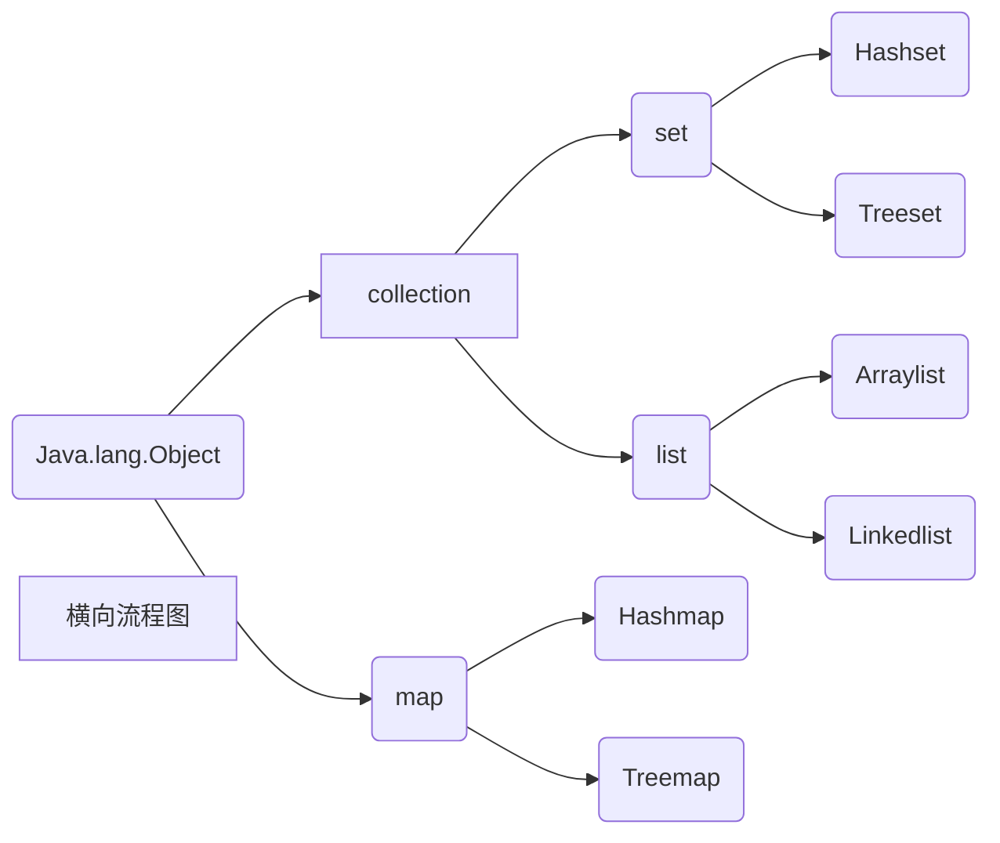

# 第 1 篇	基础知识

## 第 1 章	初识java

## 1.1	Java简介

### 1.1.5	Java API 文档

API Application Programming Interface应用程序编程接口

[JDK 11](https://docs.oracle.com/en/java/javase/11/docs/api/index/html)官方文档

[JDK 1.6](https://tool.oschina.net/apidocs/apidoc?api=jdk-zh)


## 第 3 章	Java 语言基础

### 3.2	基本数据类型

#### 3.2.1	整数类型

1. int 型

2. byte 型
3. short 型
4. long 型

- 需要在整数后加l（小写的L）或者L

十进制数

- 普通数字

八进制数

- 0与普通数字合并

十六进制数

- 0X或0x与普通数字合并

3.2.2	浮点类型

注：默认小数都被当作 double 型，如果需要用 float 小数则要在小数后加 F 或 f ，可以用 D 或 d 来表明这是 double 型，也可以不用

单精度浮点型float

float f1 = 11.23f;

双精度浮点型double

double d1 = 12.34d;

double d2 = 12.34;

#### 3.2.3	字符类型

注：‘a’ 为字符 "a" 为字符串

1. char 型

```java
char x = 'a';
char x = 97;
```

字符可以当成整形来对待

```java
char word = 'd' , word2 = '@';
int p = 23045, p2 = 45213;
System.out.println("d 在 Unicode 表中的顺序位置是: " + (int) word);
System.out.println("@在 Unicode 表中的顺序位置是: " + (int) word2);
System.out.println("Unicode 表中第 23045 位的是 " + (int) p);
System.out.println("Unicode 表中第 45213 位的是 " + (int) p2);
```


2. 转义字符

转义字符是有特殊意义的字符变量，由反斜杠 \ 开头

- \000	表示1～3 位八进制数据所表示的字符
- \u0000 表示4位十六进制所表示的字符
- \' 单引号字符
- \\ 反斜杠字符
- \t 制表符
- \r 回车
- \n 换行
- \b 退格
- \f 换页


#### 3.2.4	布尔类型

布尔类型又称作逻辑类型，简称布尔型，用boolean来定义布尔型。只有 false 与 true 两个值。

## 第 4 章	流程控制

### 4.1	复合语句

Java 语言的复合语句是以整个块区为单位的语句，所以又称块语句。

复合语句由开括号开始 "{" ，闭括号 "}" 结束。

复合语句为局部变量创建了一个作用域，如果在作用域以外使用该变量则会发生错误。

```java
public class Compound{
  public static void main(String args[]){
    int x = 20;
    {
      int y = 40;
      System.out.println(y);
      int z = 245;
      boolean b;
      {
        b = y > z;
        System.out.println(b);
      }
      String word = "hello java";
      System.out.println(word);
    }
  }
}
```

### 4.2	条件语句

#### 4.2.1	if 条件语句

1. 简单的 if 条件语句

```java
if(布尔表达式){
  语句序列
}
```


2. if…else 语句

```java
if(布尔表达式){
  语句序列1
} else {
  语句序列2
}
```


3. if…else if 多分支语句

```java
if(布尔表达式){
  语句序列1
} else if(布尔表达式2) {
  语句序列2
}
…
else if(布尔表达式n) {
  语句序列n
} 
```


#### 4.2.2	switch 多分支语句

```java
switch(表达式){

case	常量值 1:

			语句块 1

			(break;)

…

case	常量值 n:

			语句块 n

			(break;)

Default:

			语句块 n+1;

			(break;)

}
```

​	case后面的值必须不同且为不能是实数

### 4.3	循环语句

#### 4.3.1	while 循环语句

```java
while (条件表达式) {
  语句序列
}
```

while(x == 5);	系统会以为执行一条空语句从而陷入无限循环


#### 4.3.2	do…while 循环

```java
do {
  语句序列
} while(条件表达式);
```


#### 4.3.3	for 循环语句

1. for 语句

```java
for(表达式1;表达式2;表达式3){
  语句序列
}
```

2. foreach 语句

```java
for(元素类型 x: 遍历对象 obj){
  引用了 x 的 java 语句;
}
```


```java
int arr[] = {1,2,3};
//x 的类型和arr元素的类型相同。for 循环依次取出 arr 中的值并赋给 x
for (int x :arr){
  System.out.println(x);
}
```


### 4.4	循环控制

```java
指定 break 或 continue 跳出的循环
标签名 : 循环体{
	continue 标签名;
}
//标签名为任意标识符
//循环体指任意循环语句
//break 标签名：break 跳出指定的循环体，可以是内循环，也可以是外循环

Loop : for (int i =1 ; i<=3 ;i++){
  for(int j = 1;j<=5;j++){
		if (j==4){
			break Loop;
    }
    System.out.println("i = " + i + " j=" + j);
  }
}
```


#### 4.4.1	break 语句

跳出循环体

#### 4.4.2	continue 语句

跳出当次循环

## 第 5 章	数组

### 5.1	数组概述

### 数组是具有相同数据类型的一组数据的集合。

### 5.2	一维数组

#### 5.2.1	创建一维数组

1. 先声明，再用 new 关键字进行内存分配

```java
type arrayname[];
type[] arrayname;

arrayname = new type[number];
```

2. 声明的同时为数组分配内存

```java
type arrayname = new type[number];
```


#### 5.2.2	初始化一维数组

```java
type arrayname[] = new type[]{1,2,3,4,5};
type arrayname[] = {1,2,3,4,5};
```


### 5.3	二维数组

#### 5.3.1	创建一维数组

1. 先声明，再用 new 关键字进行内存分配

```java
type arrayname[][];
type[][] arrayname;

arrayname = new type[2][4];

type arrayname[2][];
type[2][] arrayname;
a[0] = new int[2];
a[0] = new int[3];
```


2. 声明的同时分配内存

```java
int a = new int[2][4];
```


#### 5.3.2	初始化二维数组

```java
type arrayname[][] = {value1,value2,...,valuen};

int arrayname[][] = {{1,2},{2,3}};
```


# 第2篇	面向对象编程

## 第六章	类和对象

### 6.1	面向对象概述

#### 6.1.1	对象

**对象是类抽象出来的事例**

#### 6.1.2	类

**类是具有相同属性和行为的一类实体**

**类是封装对象的属性和行为**

#### 6.1.3	封装

**将对象的属性和行为封装起来，其载体是类，类通常对客户隐藏其实现的细节**

#### 6.1.4	继承

**继承父类的属性和行为，延展出子类特有的属性和行为**

#### 6.1.5	多态

**父类对象应用与子类特征**

### 6.2	类

父类（基类、超类）

子类（派生类）

特点：子类拥有父类的内容并且有自己的内容

public	子类	extends	父类{

……}

### 6.2	类

#### 6.2.1	成员变量

```java
private String name;
```


#### 6.2.1	成员方法

```java
权限修饰符 返回值类型 方法名(参数类型 参数名){
  …			//方法体
    return 返回值;
}
```


#### 6.2.3	权限修饰符

privite同个类可以使用

默认default同个包可以使用

Protected修饰的成员在不同包子类可以使用，修饰的类在不同包子类不可以使用

public不同包可以使用


public和protected修饰的类可以由子类访问，如果不在同一个包下那么只有public修饰的类可以由子类访问。


#### 6.2.4	局部变量

#### 6.2.5	局部变量的有效范围

作用域

#### 6.2.6	this关键字

```java
public void setName(String name){
  this.name = name; // this.name 为本类成员
}

public Book getBook(){
  return this;//this为本类的Book
}

public void count(){
  this(1);//this为本类的构造方法
}
```


### 6.3	类的构造方法

​    定义：就是类构造对象时调用的方法，主要用来实例化对象，为成员变量赋值。构造方法分为无参构造方法、有参构造方法。
​    概念：构造方法是一种特殊的“成员方法”
​         1,构造方法作用：（1）构造出来一个类的实例 （2）对构造出来个一个类的实例（对象）初始化
​         2,构造方法的名字必须与定义他的类名完全相同，没有返回类型，甚至连void也没有
​         3,主要完成对象的初始化工作，构造方法的调用是在创建一个对象时使用new操作进行的
​         4,类中必定有构造方法，若不写，系统自动添加无参构造方法。接口不允许被实例化，所以接口中没有构造方法
​         5,不能被static、final、synchronized、abstract和native修饰
​         6,构造方法在初始化对象时自动执行,一般不能显式地直接调用.
​            当同一个类存在多个构造方法时，java编译系统会自动按照初始化时最后面括号的参数个数以及参数类型来自动一一对应完成构造函数的调用
​         7,构造方法可以被重载。没有参数的构造方法称为默认构造方法，与一般的方法一样，构造方法可以进行任何活动但是经常将他设计为进行各种初始化活动，比如初始化对象的属性

​		8,当类中定义的构造方法不是无参的，那么编译器不会自动生成无参的构造方法，只有没有定义任何构造方法的时候才会自动创建一个不带参数的默认构造方法。

```java
//构造方法的定义语法格式
public（构造方法修饰符） Book（构造方法名）(){
  //构造方法体
}
```

### 6.4	静态变量和静态方法

```java
//静态成员调用
//静态对象属于所有类共享
//属于类层级，不属于对象层级
类名.静态类成员
```

```java
//静态代码块
//作用：执行类先执行类的初始化操作
//只会执行一次
static{
  //初始化操作的代码
}
```

```java
//静态导包用法，将类的方法直接导入到当前类中，从而直接使用“方法名”即可调用类方法，更加方便。
//就好像是该类自己的方法一样使用即可
//import static com.dotgua.study.PrintHelper(包路径).*;
```

注：

1. 静态方法中不能使用this
2. 静态方法中不能直接调用非静态方法
3. 局部变量不可以用static修饰
4. 主方法必须用static声明
5. 只有内部类可以使用static关键字声明
6. 在创建对象时，static修饰的成员会首先被初始化然后是普通成员，最后是构造方法
7. 当我们第一次去使用一个类时，就会触发该类的成员初始化。
8. 使用方法前首先进行对象初始化，方法和对象如果被static修饰，就从对象层级上升为类层级。


### 6.5	类的主方法

```java
//psvm
  public static void main(String[] args){
  					//方法体
}
```

### 6.6	对象


#### 6.6.1	对象的创建

```java
Test test = new Test("a");//创建对象并且初始化
```


#### 6.6.2	访问对象的属性和行为

```java
对象.类成员
```


#### 6.6.3	对象的引用

```java
//类名 引用 = 对象的实体;
People tom = new People();
//tom 是 new Peopel()的代理人
  
tom.getClass() == new People().getClass()
```


#### 6.6.4	对象的销毁

- 对象超出作用域将被销毁
- 对象被赋值为 null 将被销毁


## 第七章	继承、多态、抽象类与接口

### 7.1	类的继承

```java
class Child extends Parent{}
```

1. 子类继承父类之后，创建对象的同时会使用子类的构造方法
2. 子类继承父类之后可以调用父类创建好的属性和方法
3. 不可以继承多个，但可以多代继承


### 7.3	对象类型的转化

#### 7.3.1	向上转型

向上类型转换（小转大）： 
语法规则：<父类型> <引用变量名> = new <子类型>(); 
1.此时通过父类引用变量调用的方法是子类覆盖或继承 
父类的方法，不是父类的方法。 
2.此时通过父类引用变量无法调用子类特有的方法。

#### 7.3.2	向下转型

```java
子类类型 子类对象 = (子类类型)父类对象;
//两个没有继承关系的对象不能进行转型
//父类对象可以强制转化为子类对象，父类对象要先引用子类对象
//即必须先向上转型才能再向下转型
```


总结一下，很多时候，我们需要把很多种类的实例对象，全部扔到一个集合。
把Thinkpad笔记本，Mouse鼠标，KeyBoard键盘等实例对象，全部扔到一个Shopcar购物车集合。 
但是肯定不可能给他们每个种类都用一个独立的集合去存放吧，这个时候我们应该寻找到一个标准，接口就是一个标准。这些都是各种电子产品，抽象成电子产品。然后一个Electronics接口就出来了。 
在回到刚才，我们把很多种类的实例对象全部扔到一个集合。或许这样比较好理解：把很多种类的子类实例对象全部扔到存放父类实例的集合。 
经过了这个过程，子类实例已经赋值给了父类引用（即完成了向上转型），但很遗憾的丢失了子类扩展的方法。 
很好的是Java语言有个向下转型的特性，让我们可以重新获得丢失的方法，即强转回子类 
所以我们需要用到子类实例的时候，就从那个父类集合里拿出来向下转型就可以了，一样可以使用子类实例对象

java向下转型的意义：
最大的用处是java的泛型编程，用处很大，Java的集合类都是这样的。

### 7.6	final关键字

#### 7.6.1	final变量

```java
final	数据类型	常量名 = 值；
  //一定要赋值
```

#### 7.6.2	final方法

```java
public final 返回值类型 方法名(参数列表){
  //方法体
}
//父类中的方法如果被final修饰，子类就不能重写
```

#### 7.6.3	final类

```java
public final class 类名{}
//类被final修饰就不能被继承
```

### 7.7	多态

- 多态：父类引用指向子类对象，接口引用指向实现类对象

- 多态成员的访问特点
  - 成员变量
    - 编译看父类，运行看父类
  - 成员方法
    - 编译看父来，运行看子类
- 多态的使用场景
  - 作为方法的参数和返回值

### 7.8	抽象类和接口

#### 7.8.1	抽象类


抽象类是指在普通类的结构里面增加**抽象方法**的组成部分。

**抽象方法，是指没有方法体的方法，同时抽象方法还必须使用关键字abstract做修饰**。

**拥有抽象方法的类就是抽象类，抽象类要使用abstract关键字声明。**

抽象类不能直接实例化，需要依靠子类采用向上转型的方式处理；

抽象类必须有子类，使用extends继承，一个子类只能继承一个抽象类；

子类（如果不是抽象类）则必须覆写抽象类之中的全部抽象方法（如果子类没有实现父类的抽象方法，则必须将子类也定义为为[abstract](https://so.csdn.net/so/search?q=abstract&spm=1001.2101.3001.7020)类。）；

抽象类继承子类里面有明确的方法覆写要求，而普通类可以有选择性的来决定是否需要覆写；

**抽象类所起的功能就是一个类定义模板的功能。**


```java
//定义抽象类的语法
public abstract class Parent{
  abstract void testAbstract();				//定义抽象方法
}
```

#### 7.8.2	接口

```java
//接口使用interface关键字进行定义
public interface Paintable{
  void draw();
  //方法省略pubic abstract
  //接口中所有的字段都是static，final
}
```

接口是解决**Java无法使用多继承**的一种手段

**一个接口只有方法的特征没有方法的实现，因此这些方法可以在不同的地方被不同的类实现，而这些实现可以具有不同的行为**

接口指明了一个类必须要做什么和不能做什么，相当于类的蓝图

如果一个类实现了一个接口中要求的所有的方法，然而没有提供方法体而仅仅只有方法标识，那么这个类一定是一个抽象类。（必须记住：**抽象方法只能存在于抽象类或者接口中，但抽象类中却能存在非抽象方法，即有方法体的方法。接口是百分之百的抽象类**）

接口被用来实现抽象，而抽象类也被用来实现抽象，为什么一定要用接口呢？接口和抽象类之间又有什么区别呢？原因是抽象类内部可能包含非final的变量，但是在接口中存在的变量一定是final，public,static的。

***我们不能直接去实例化一个接口，因为接口中的方法都是抽象的，是没有方法体的***，这样怎么可能产生具体的1实例呢？但是，**我们可以使用接口类型的引用指向一个实现了该接口的对象，并且可以调用这个接口中的方法**。

1. 一个类可以实现不止一个接口。

？？一个接口可以继承于另一个接口，或者另一些接口，接口也可以继承，并且可以多继承

2. 一个类可以实现不止一个接口。
3. 一个接口可以继承于另一个接口，或者另一些接口，接口也可以继承，并且可以多继承。
4. 一个类如果要实现某个接口的话，那么它必须要实现这个接口中的所有方法。
5. 接口中所有的方法都是抽象的和public的，所有的属性都是public,static,final的。
6. 接口用来弥补类无法实现多继承的局限。
7. 接口也可以用来实现解耦。


## 第 8 章	包和内部类

### 8.1	Java 类包

#### 8.1.1	类名冲突

解决方法：放在不同的包下

#### 8.1.2	完整的类路径

类路径 = 包的名称 与 类的名称的组合

```java
//程序中使用两个不同Date类的完整类路径
java.uti.Date date = new java.uti.Date();
java.sqp.Date date2 = new java.sqp.Date(1000);
```

同一个包中的类相互访问可以不指定包名

#### 8.2.1	成员内部类

```java
class OuterClass{		//外部类
  class InnerClass{		//内部类
    
  }
}
```

1、 Inner 类定义在 Outer 类的内部，相当于 Outer 类的一个成员变量的位置，Inner 类可以使用任意访问控制符，如 public 、 protected 、 private 等

2、 Inner 类中定义的 test() 方法可以直接访问 Outer 类中的数据，而不受访问控制符的影响，如直接访问 Outer 类中的私有属性

3、 定义了成员内部类后，必须使用外部类对象来创建内部类对象，而不能直接去 new 一个内部类对象，即：内部类 对象名 = 外部类对象.new 内部类( );

外部类是不能直接使用内部类的成员和方法滴

可先创建内部类的对象，然后通过内部类的对象来访问其成员变量和方法。

2、 如果外部类和内部类具有相同的成员变量或方法，内部类默认访问自己的成员变量或方法，如果要访问外部类的成员变量，可以使用 this 关键字。

```java
public class TheSameName{
  private int x = 7;//外部类的x
  private class Inner{
    private int x = 9;//内部类的x
    public void doit({
      int x = 11;//局部变量x
      x++;
      this.x++;//调用内部类的x
      TheSameName.this.x++;//调用外部类的x
    })
  }
}
```


#### 8.2.2 匿名内部类


```java
//现用现写，只能使用一次
new 父类/父接口{
  子类实现的内容
};

```

注：匿名类不能有静态方法和构造方法

```java
interface Product
{
   public double getPrice();
   public String getName();
}
public class AnonymousTest
{
   public void test(Product p)
   {
      System.out.println("购买了一个" + p.getName()
         + "，花掉了" + p.getPrice());
   }
   public static void main(String[] args)
   {
      AnonymousTest ta = new AnonymousTest();
      // 调用test()方法时，需要传入一个Product参数，
      // 此处传入其匿名内部类的实例
      ta.test(new Product()
      {
         public double getPrice()
         {
            return 567.8;
         }
         public String getName()
         {
            return "AGP显卡";
         }
      });
   }
}
```


# 第 3 篇	核心技术

## 第 9 章	异常处理。

### 9.1	异常概述

异常机制是指当程序出现错误后，程序如何处理。具体来说，异常机制提供了程序退出的安全通道。当出现错误后，程序执行的流程发生改变，程序的控制权转移到异常处理器。

  程序错误分为三种：1.编译错误；2.运行时错误；3.逻辑错误。
  （1）编译错误是因为程序没有遵循语法规则，编译程序能够自己发现并且提示我们错误的原因和位置，这个也是大家在刚接触编程语言最常遇到的问题。
  （2）运行时错误是因为程序在执行时，运行环境发现了不能执行的操作。
  （3）逻辑错误是因为程序没有按照预期的逻辑顺序执行。

异常也就是指程序运行时发生错误，而异常处理就是对这些错误进行处理和控制。

当某一方法发生异常时，这一方法会产生异常对象，并把它传递给正在运行的系统。这个对象就是异常对象。通过异常处理机制，可以将非正常情况下的处理代码与程序的主逻辑分离，即在编写代码主流程的同时在其他地方处理异常。

### 9.2	异常的抛出和捕捉

#### 9.2.1	抛出异常

在 Java 应用程序中，异常处理机制为：抛出异常，捕捉异常。

抛出异常：当一个方法出现错误引发异常时，方法创建异常对象并交付运行时系统，异常对象中包含了异常类型和异常出现时的程序状态等异常信息。运行时系统负责寻找处置异常的代码并执行。

 **Throwable**： 有两个重要的子类：Exception（异常）和 Error（错误），二者都是 Java 异常处理的重要子类，各自都包含大量子类。异常和错误的区别是：异常程序本身可以处理，错误是无法处理。

## 第 10 章	字	符	串

### 10.7	字符串生成器

- 使用 StringBuilder 类
- append(content) 向字符串生成器中追加内容
- toString() 输出字符串结果

## 第 11 章	常用类库

### 11.1	包	装	类

定义：将基本数据类型封装在包装类中

- 包装类 基本数据类型

- Byte byte
- Integer int
- Float float
- Double double
- Character char
- Short short
- Long long
- Double double
- Boolean boolean

装箱：将基本数据类型转化为包装类

拆箱：将包装类转化为基本数据类型

#### 11.1.1 Integer 类

1. valueOf(String str) //将 str 包装为 Integer 对象
2. valueOf(Int a, Int b) //将十进制转化为b进制
3. paresInt(String str)//将str包含的数转化为等价数字int
4. toBinaryString(int i)//转化为二进制
5. toHexString(int i)//转化为十六进制
6. toOctalString(int i)//转化为八进制
7. equals(Object IntegerObj)//两对象是否相等
8. compareTo(Integer anotherInteger) //比较是否相等，相等返回0，小于返回小于0，大于返回大于0


### 11.2	数字处理

#### 11.2.3	Random 类

```java
获得Random 类对象
Random r = new Random();//以当前时间为随机数种
Random r = new Random(随机数种子);
```

- public int nextInt() 返回一个随机整数
- public int nextInt(int n) 返回一个大于等于0，小于n的整数

## 第 12 章	集合类

### 12.1	集合类概述

**常用集合类的继承关系**



### 12.2	Collection 接口

- add(E e)	将指定的对象添加到集合中
- remove(Object o)     将指定的对象移除集合
- isEmpty().   返回布尔类型，判断集合是否为空
- Iterator().   返回迭代器，用于遍历数组
- - 对象.hasnext().   判断是否有下一个元素
  - 对象.next().    获取当前元素，并指向下一个元素	

- Size().   判读数组元素个数 


### 12.3	List 集合

#### 12.3.1	List 接口

Get(int index)	获得指定索引的元素

set(int index,Object obj)	将集合中指定索引的元素用该元素替代

#### 12.3.2	List接口的所有实现类

- Arraylist

  - 一、初始化：

    1、不初始化容量

    ```java
    ArrayList arr1 = new ArrayList(); //不初始化刚开始的数组容量，当数组容量满时数组会自动一当前数组容量的2倍扩容
    ```

    2、初始化容量

    ```java
    ArrayList arr2 = new ArrayList(3);//初始容量为3
    ```

    3、用一个集合或数组初始化 

    ```java
    ArrayList arr3 = new ArrayList(a);        //a为集合或数组
    ```

  - 二、添加元素

  - 方法：1）add（object value） ;将指定元素object value追加到集合的末尾

  - 2） add（int index,  Object obj）;

    功能：在集合中指定index位置，添加新元素obj

    功能说明：假设集合list中有元素[“java”,“javaEE”]，当使用add(1，“javaWeb”)后，集合list中的元素为[“java”,“javaWeb”,“JavaEE”]。

  - 三、删除元素

  - 方法：remove();

    功能：从集合中删除指定位置处的元素，返回该元素

  - 四、获取数组

    方法：size() ;

    功能：用于获取ArrayList的大小，返回集合中的元素个数。

  - 五、替换元素

    方法：set() ;

    功能：用指定元素obj替代集合中指定index位置的元素

    功能说明：假设集合list中有元素[“java”,“javaEE”]，当使用set(0，“javaWeb”)后，集合list中的元素为[“javaWeb”,“JavaEE”]

  - 六、清空集合内的所有元素

    方法：clear() ;

    功能：清空集合中所有元素

    功能说明：假设集合list中有元素[“java”,“javaEE”]，当使用clear()后，集合list中的元素为空[]。

    ```javascript
    arr.clear();     //清空arr里的所有元素
    ```

  -  七、查找元素

    方法：get(***int index***);  //index -- 该元素返回的索引值

    功能：返回集合中指定位置上的元素

    

    Linkedlist

```java
List<E> list = new Arraylist<>();//E为java数据类型
List<E> list = new Linkedlist<>();
```

## 13.2	泛型

### 13.2.1	回顾向上转型与向下转型

### 13.2.2	定义泛型类

class 类名<T>{

​	private T a(T text){

​	}

}


泛型的作用：

1. 指定之后下面有用到该参数的内容都会被此值替代，只能传这种类型的数据进来使用

2. 避免了数据中转化异常


## 第 20 章	多线程

### 20.1线程简介

程序：静态代码

进程：程序的执行过程

线程：进程中要同时干几件事时，每一件事的执行路径成为线程。

并行：多个CPU同时执行多个任务

并发：一个CPU（采用时间片）同时执行多个任务

### 20.2	创建线程

#### 20.2.1	继承 Thread 类

```java
//1.创建一个集成于Thread类的子类 （通过ctrl+o（override）输入run查找run方法）
//2.重写Thread类的run（）方法
//3.创建Thread子类的对象
//4.通过此对象调用start（）方法
public class MyThread extends Thread{
  @Override
  public void run(){
    //线程体
  }
  
  public void static main(String[] args){
    MyThread mythread = new MyThread();
    mythread.start();//start方法的作用：1.启动当前线程 2.调用当前线程的重写的run方法
    //start()只能开启没有开启的线程	
  }
}
```

#### 20.2.2	实现Runnable接口

```java
//利用Runnable接口启动线程
public class 实现类 implements Runnable{
  @Override
  public void run(){
    //线程体
  }
}
//1. 建立 Runable 对象
//2. 使用参数为 Runnable 对象的构造方法创建 Thread 实例
//3. 调用 start()方法启动线程
public class 测试类{
  //psvm
  public static void main(String args[]){
    Thread t = new Thread(new 实现类);
    t.start();
  }
}

```


问题？？？一个接口可以继承于另一个接口，或者另一些接口，接口也可以继承，并且可以多继承